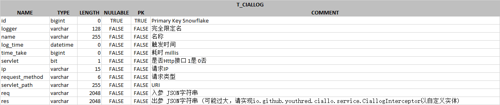

# Ciallo ~ ⭐

> 方法切片信息打印及持久化的 Springboot starter

## Usage

### 引入Maven坐标 (中央仓库暂无)

``` xml
<dependency>
    <groupId>io.github.youthred</groupId>
    <artifactId>ciallo-spring-boot-starter</artifactId>
</dependency>
```

- 版本配置

``` xml
<properties>
    <spring-boot.version>2.3.0.RELEASE</spring-boot.version>
    <maven-compiler-plugin.version>3.1</maven-compiler-plugin.version>
    <maven.compiler.source>1.8</maven.compiler.source>
    <maven.compiler.target>1.8</maven.compiler.target>
    <project.build.sourceEncoding>UTF-8</project.build.sourceEncoding>
    <hutool.version>5.8.3</hutool.version>
    <lombok.version>1.18.24</lombok.version>
    <commons-lang3.version>3.12.0</commons-lang3.version>
    <commons-collections4.version>4.4</commons-collections4.version>
    <commons-compress.version>1.21</commons-compress.version>
    <logback.version>1.2.11</logback.version>
</properties>
```

### Starter配置

``` yml
ciallo:
  # enable: true # 启用Ciallo 默认true
  # save-log: true # 启用日志入库 默认true
  # log-table-name: T_CIALLOG # 日志持久化库表名称 默认T_CIALLOG
  # real-ip-header: ? # 使用Nginx代理时的真实IPHeader名称 无默认 非必填
  ds: # 数据源信息
    driver-class-name: ${spring.datasource.dynamic.datasource.master.driver-class-name} # 必填
    url: ${spring.datasource.dynamic.datasource.master.url} # 必填
    username: ${spring.datasource.dynamic.datasource.master.username} # 必填
    password: ${spring.datasource.dynamic.datasource.master.password} # 必填
    # show-sql: false # 是否在日志中显示执行的SQL 默认false
    # format-sql: false # 是否格式化显示SQL 默认false
    # show-params: false # 是否显示SQL参数 默认false
    # sql-level: debug # 是否在日志中显示执行的SQL 默认debug
```

### 注解 Ciallo

- 现仅支持用于注解方法

``` java
package io.github.youthred.ciallo.annotation;

import java.lang.annotation.*;

/**
 * @author https://github.com/youthred
 */
@Documented
@Target({ElementType.METHOD})
@Retention(RetentionPolicy.RUNTIME)
public @interface Ciallo {

    /**
     * 方法名称
     * @return String
     */
    String value() default "";

    /**
     * 是否属于HTTP接口调用
     * 
     * @return 默认true
     */
    boolean servlet() default true;
}
```

### 默认入库信息



### 自定义实现

#### 自定义实体构造

实现`io.github.youthred.ciallo.service.CiallogInterceptor`并Spring组件化

eg.

``` java
import io.github.youthred.ciallo.annotation.Ciallo;
import io.github.youthred.ciallo.entity.Ciallog;
import io.github.youthred.ciallo.service.CiallogInterceptor;
import org.aopalliance.intercept.MethodInvocation;
import org.springframework.stereotype.Component;

@Component
public class MyCiallogInterceptor implements CiallogInterceptor {

    /**
     * 自定义实现入库实体构造
     *
     * @param ciallog    默认实体
     * @param ciallo     Ciallo注解
     * @param invocation MethodInvocation
     * @return Object 默认Ciallog
     */
    @Override
    public Object ciallog(Ciallog ciallog, Ciallo ciallo, MethodInvocation invocation) {
        /*
         * 若返回类型不是 io.github.youthred.ciallo.entity.Ciallog, 并且需要持久化
         * 则需实现 io.github.youthred.ciallo.service.CiallogSaver 以自定义处理
         */
        return new Ciallog();
    }
}
```

#### 自定义持久化处理

实现`io.github.youthred.ciallo.service.CiallogSaver`并Spring组件化

eg.

``` java
import io.github.youthred.ciallo.entity.Ciallog;
import io.github.youthred.ciallo.service.CiallogSaver;
import lombok.extern.slf4j.Slf4j;
import org.springframework.stereotype.Component;

@Slf4j
@Component
public class MyCiallogSaver implements CiallogSaver {

    @Override
    public void save(Object o) {
        // 或者是自定义 CiallogInterceptor 的返回体
        Ciallog ciallog = (Ciallog) o;
        // todo
    }
}
```

### 库表数据示例


